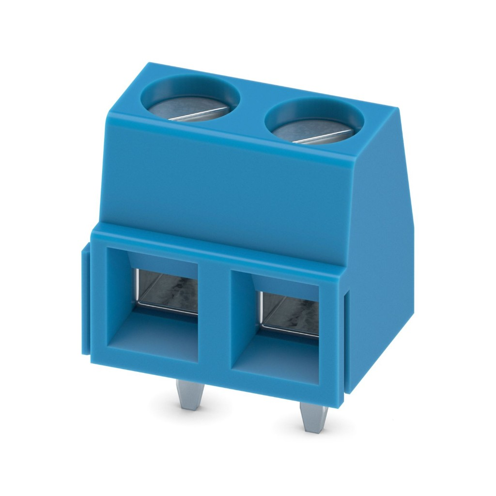
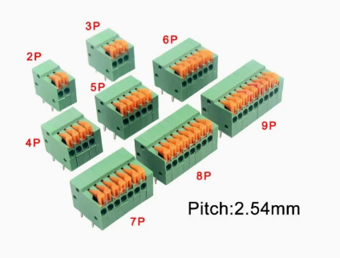

# PA(EN) Components Library

Fusion Electronics library (`PA(EN)_Components_Library.flbr`) plus design rules (`DesignRules.dru`).

This replaces the previous Autodesk Eagle library (`common components.lbr`).

## Library summary

| Type | Count |
|------|------:|
| Components (devicesets) | 87 |
| Symbols | 93 |
| Footprints (packages) | 259 |

| Category | Components |
|----------|----------:|
| Passive components | 4 |
| Discrete semiconductors | 7 |
| ICs | 2 |
| Connectors | 31 |
| Switches | 3 |
| Sensors and displays | 7 |
| Motors and actuators | 5 |
| Power and batteries | 5 |
| Modules and development boards | 13 |
| Supply symbols | 5 |
| Mechanical, documentation, custom | 5 |
| **Total** | **87** |

Open `PA(EN)_Components_Library.flbr` in Autodesk Fusion (Electronics library). Upload it to a Fusion project if you need it in Library Manager.

## Passive components (4)

| Component | Description |
|-----------|-------------|
| `R` | Generic fixed resistor (chip, MELF, axial) |
| `C` | Generic non-polarized capacitor (chip, tantalum, radial) |
| `C-POL` | Generic polarized capacitor (tantalum, electrolytic) |
| `POT` | Bourns PV36 trimmer potentiometer (and HA-06) |

## Discrete semiconductors (7)

| Component | Description |
|-----------|-------------|
| `SS9014` | NPN transistor |
| `SS9012` | PNP transistor |
| `1N581*` | 1.0 A Schottky barrier rectifier |
| `DIODE` | Generic rectifier diode (SOD/SMA/SMB/SMC/axial) |
| `LED` | LED (3 mm, 5 mm, 0603, 1206) |
| `LED_COB` | COB LED |
| `PATTERN_LED` | LED pattern array |

## ICs (2)

| Component | Description |
|-----------|-------------|
| `*555` | 555 timer (DIP, SOIC, SOICW, VSSOP, TSSOP8) |
| `LD1117` | Linear voltage regulator (TO-263, SOT-223, TO-220) |

## Connectors (31)

### Terminal blocks

<table>
<thead>
<tr>
<th>Photo</th>
<th>Component</th>
<th>Description</th>
</tr>
</thead>
<tbody>
<tr>
<td rowspan="7" valign="middle"></td>
<td><code>MKDSN1,5/2-5,08</code></td>
<td>Phoenix 2-pin screw terminal, 5.08 mm</td>
</tr>
<tr>
<td><code>MKDSN1,5/3-5,08</code></td>
<td>Phoenix 3-pin screw terminal, 5.08 mm</td>
</tr>
<tr>
<td><code>MKDSN1,5/4-5,08</code></td>
<td>Phoenix 4-pin screw terminal, 5.08 mm</td>
</tr>
<tr>
<td><code>MKDSN1,5/5-5,08</code></td>
<td>Phoenix 5-pin screw terminal, 5.08 mm</td>
</tr>
<tr>
<td><code>MKDSN1,5/6-5,08</code></td>
<td>Phoenix 6-pin screw terminal, 5.08 mm</td>
</tr>
<tr>
<td><code>MKDSN1,5/7-5,08</code></td>
<td>Phoenix 7-pin screw terminal, 5.08 mm</td>
</tr>
<tr>
<td><code>MKDSN1,5/8-5,08</code></td>
<td>Phoenix 8-pin screw terminal, 5.08 mm</td>
</tr>
<tr>
<td rowspan="4" valign="middle"></td>
<td><code>FK141R-254-2P</code></td>
<td>KF141R 2-pin terminal, 2.54 mm</td>
</tr>
<tr>
<td><code>FK141R-254-4P</code></td>
<td>KF141R 4-pin terminal, 2.54 mm</td>
</tr>
<tr>
<td><code>FK141R-254-5P</code></td>
<td>KF141R 5-pin terminal, 2.54 mm</td>
</tr>
<tr>
<td><code>FK141R-254-9P</code></td>
<td>KF141R 9-pin terminal, 2.54 mm</td>
</tr>
<tr>
<td></td>
<td><code>KF142R-508-2P</code></td>
<td>KF142R 2-pin terminal, 5.08 mm</td>
</tr>
<tr>
<td></td>
<td><code>KF142R-508-5P</code></td>
<td>KF142R 5-pin terminal, 5.08 mm</td>
</tr>
</tbody>
</table>

### Pin headers

| Component | Description |
|-----------|-------------|
| `PINHD-1X2` | 1×2 pin header (straight / 90°) |
| `PINHD-1X3` | 1×3 pin header (straight / 90°) |
| `PINHD-1X4` | 1×4 pin header (straight / 90°) |
| `PINHD-1X5` | 1×5 pin header (straight / 90° / 2 mm pitch) |
| `PINHD-1X6` | 1×6 pin header (straight / 90°) |
| `PINHD-1X7` | 1×7 pin header (straight / 90°) |
| `PINHD-1X8` | 1×8 pin header (straight / 90°) |
| `PINHD-1X9` | 1×9 pin header (straight / 90°) |
| `PINHD-1X10` | 1×10 pin header (straight / 90°) |
| `PINHD-1X11` | 1×11 pin header (straight / 90°) |
| `PINHD-1X12` | 1×12 pin header (straight / 90°) |
| `PINHD-1X13` | 1×13 pin header (straight / 90°) |
| `PINHD-1X14` | 1×14 pin header (straight / 90°) |
| `PINHD-1X15` | 1×15 pin header |
| `PINHD-1X16` | 1×16 pin header (straight / 90°) |
| `PINHD-1X20` | 1×20 pin header (straight / 90°) |
| `FE09-1` | 9-pin female header |

### Power connectors

| Component | Description |
|-----------|-------------|
| `XT60` | XT60 power connector (male / female) |

## Switches (3)

| Component | Description |
|-----------|-------------|
| `MOMENTARY-SWITCH-SPST` | SPST tactile / pushbutton (PTH and SMD variants) |
| `SS12D10` | Vertical 3-pin slide switch |
| `SS12D11` | Right-angle 3-pin slide switch |

## Sensors and displays (7)

| Component | Description |
|-----------|-------------|
| `QRE1113` | Reflectance / line sensor |
| `IR-RECEIVER` | 38 kHz IR receiver (PNA4602 family) |
| `PHOTOCELL` | Photoresistor (GL5528) |
| `VL53L0X` | Time-of-flight distance sensor |
| `MPU6050` | 3-axis accel / gyro IMU (standard / mini) |
| `HC-SR04` | Ultrasonic distance sensor |
| `OLED_0.96_I2C` | 0.96" OLED, I2C |

## Motors and actuators (5)

| Component | Description |
|-----------|-------------|
| `MOTOR` | Generic DC motor |
| `SERVO` | Servo (SG90 / SM-S2309S) |
| `N20_GEARMOTOR` | N20 gearmotor |
| `24GP-MOTOR` | 24GP motor |
| `36GP-MOTOR` | 36GP motor |

## Power and batteries (5)

| Component | Description |
|-----------|-------------|
| `CR2032` | CR2032 coin cell (SMT / TH) |
| `BATTERY` | Generic battery |
| `BATTERY-HOLDER-CR2032` | CR2032 battery holder |
| `DC_POWER_MODULE` | DC power module |
| `E326S` | 12 V lithium battery pack (12伏鋰電池組 E326S) |

## Modules and development boards (13)

| Component | Description |
|-----------|-------------|
| `ARDUINO-UNO-R3-SHIELD` | Arduino Uno R3 shield footprint |
| `ESP32-DEVKITV1` | ESP32 DevKit V1 |
| `ESP32-CAM` | ESP32 camera module |
| `RPI_PICOW_IG` | Raspberry Pi Pico W (SMD / TH) |
| `PAEN_RPI` | Raspberry Pi through-hole header board |
| `XIAO-SAMD21` | Seeed XIAO SAMD21 |
| `XIAO-RP2040` | Seeed XIAO RP2040 |
| `XIAO-ESP32C3` | Seeed XIAO ESP32-C3 |
| `XIAO-NRF52840/SENSE` | Seeed XIAO nRF52840 / Sense |
| `XIAO-THRUHOLE` | Generic XIAO through-hole / hybrid module |
| `ADS1115` | ADS1115 16-bit I2C ADC module for analog measurement |
| `DRV8825_MODULE` | DRV8825 stepper driver module |
| `DRV8833_MODULE` | DRV8833 motor driver module |

## Supply symbols (5)

| Component | Description |
|-----------|-------------|
| `+5V` | 5 V supply |
| `3V3` | 3.3 V supply |
| `12V` | 12 V supply |
| `VCC` | VCC supply |
| `GND` | Ground |

## Mechanical, documentation, custom (5)

| Component | Description |
|-----------|-------------|
| `MOUNT-PAD-ROUND` | Round mounting pad (2.8–5.5 mm) |
| `A4L-LOC` | DIN A4 landscape drawing frame |
| `ART` | Artwork / logo |
| `24GP-MOTOR-MOUNT` | 24GP motor mount |
| `BOTTLE_SUMO_MAIN` | Bottle Sumo main board |

## Files

| File | Description |
|------|-------------|
| `PA(EN)_Components_Library.flbr` | Fusion Electronics library |
| `DesignRules.dru` | Design rules |
